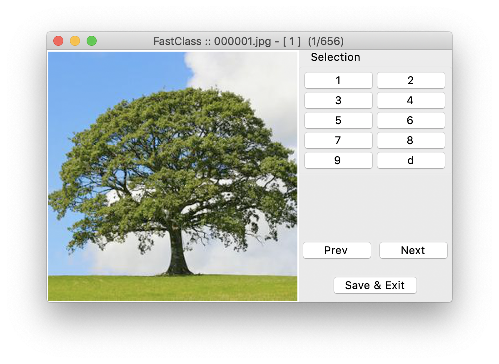

# FastClass


A little set of tools to batch download images and weed through, delete and
classify them into groups for building deep learning image datasets.

I wrote up a small [blog post](https://www.christianwerner.net/tech/Build-your-image-dataset-faster/) on my site [www.christianwerner.net](https://www.christianwerner.net).

## Installation

`pip install git+https://github.com/cwerner/fastclass.git#egg=fastclass`

The installer will also place the executables **fcc** and **fcd** in your \$PATH.

The package currently contains the follwing tools:

## Download images

Use **fcd** to crawl search engines (Google, Bing, Baidu, Flickr) and pull all images for
a defined set of queries. In addition, files are renamed, scaled and checked
for duplicates.

You provide queries and terms that should be excluded when naming the category folders. There
is an example (guitars.csv) provided in the repository.

### Usage

Call the script from the commandline. If you omit any input parameters it
will show you the help page.

```
Usage: fcd [OPTIONS] INFILE

Options:
  -c, --crawler [ALL|GOOGLE|BING|BAIDU|FLICKR]
                                  selection of crawler (multiple invocations
                                  supported)  [default: ALL] (Note: BAIDU and FLICKR are not included in ALL option)
  -k, --keep                      keep original results of crawlers  [default:
                                  False]
  -m, --maxnum                    maximum number of images per crawler [default: 1000]
  -s, --size INTEGER              image size for rescaling  [default: 299]
  -o, --outpath TEXT              name of output directory  [default: dataset]
  -h, --help                      Show this message and exit.

  ::: FastClass fcd :::

  ...an easy way to crawl the net for images when building a dataset for
  deep learning.

  Example: fcd -c GOOGLE -c BING -s 224 example/guitars.csv
```

If you specify the _-k, --keep_ flag a second folder called outpath.raw containing the original/ unscled images will be created.

### Search file format

The csv file currently requires two columns (columns are seperated by a comma (,)) and each row defines a image class you want to download (see the guitars.csv file in the example folder). The first row contains a header which will be skipped.

Column 1 contains the search terms. You can specify multiple searchterms using space between them. If you want to require a search term enclose it in quotation marks (") (you can use the normal query syntax you'd normally use in a google search - i.e. filetype:jpg). In column 2 you can specify terms that should not be included in the final class names. An example would be that you want to add guitar to your search terms to help the search but don't need that term in the final folder class names. If you do not want to specify this column you can leave it blank (i.e., end the line with a comma).

## Clean image sets

Once downloaded use **fcc** to quickly inspect the loaded files and rate or
classify them. You can also mark them for deletion.



### Usage

Call the script from the commandline. If you omit any input parameters it
will show you the help page.

```
Usage: fcc [OPTIONS] INFOLDER [OUTFOLDER]

  FastClass fcc

Options:
  --nocopy TEXT  disable filecopy for cleaned image set  [default: False]
  -h, --help     Show this message and exit.

  ::: FastClass fcc ::: ...a fast way to cleanup/ sort your images when
  building a dataset for deep learning.

  Note: In the application use the following keys: <1>, <2>, ... <9> for
  class assignments or quality ratings <space> assigns <1> <d> to mark a
  deletion <x> to terminate the app/ write output

  Use the buttons to navigate back and forth without changing the
  classification. The current classification of an image is given in the
  title bar (X indicated a mark for deletion). The counter in the titlebar
  gives number of classified images vs the total number in the input folder.

  In the output csv file 1,2 depcit class assignments/ ratings,  -1
  indicates files marked for deletion (if not excluded with -d).
```

## Flickr Crawler

The Flickr crawler requires an API key. FastClass looks for the key in an environment variable called `FLICKR_API_KEY`. Request one from the [Flickr API key application page.](https://www.flickr.com/services/apps/create/apply/)

`FLICKR_API_KEY=asdf1234asdf456 fcd -c FLICKR my_project.csv`
